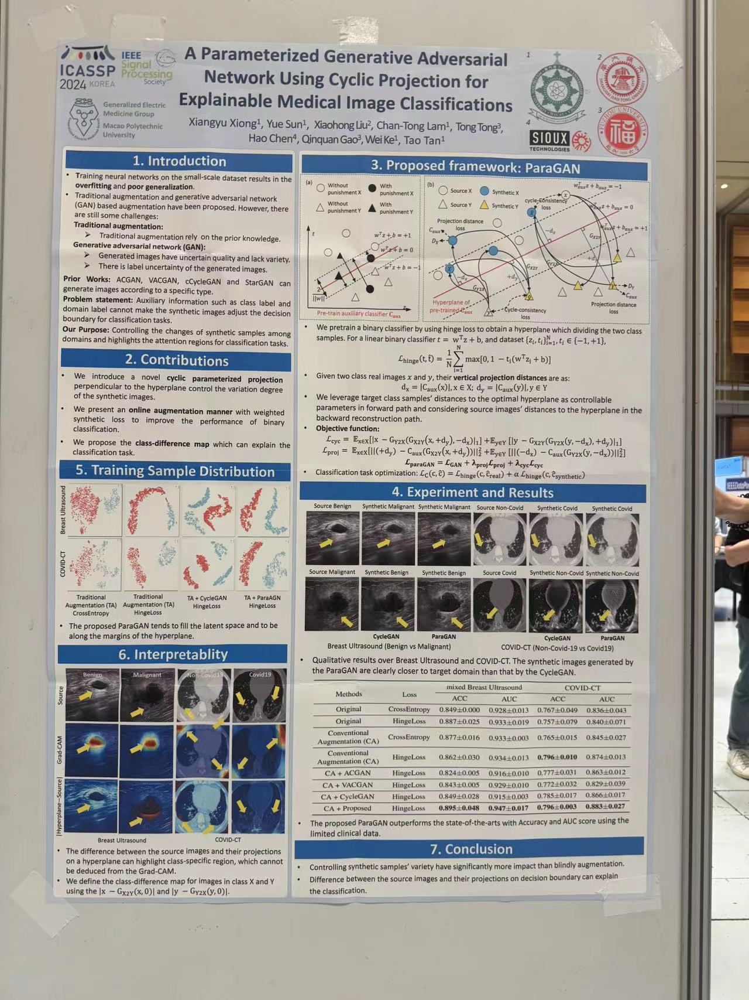

# Important:
ICASSP 2024 Poster. Paper: A Parameterized Generative Adversarial Network Using Cyclic Projection for Explainable Medical Image Classification.

<p align='left'>
  
</p>

# Prerequisites
- Linux
- Python 3.8
- NVIDIA GPU + CUDA CuDNN
- anaconda virtual environment
  ```
  conda install pytorch torchvision torchaudio pytorch-cuda=11.7 -c pytorch -c nvidia  
  
  conda install tqdm  
  
  conda install matplotlib==3.3.4  
  
  conda install seaborn  
  
  conda install scikit-learn  
  ```
# Dataset Discription
-covid_ct：
```
├─train├─X
│      │  001non-covid19.png
│      │  002non-covid19.png
│      ├─Y
│      │  001covid19.png
│      │  002covid19.png
├─valid├─X
│      │  001non-covid19.png
│      │  002non-covid19.png
│      ├─Y
│      │  001covid19.png
│      │  002covid19.png
├─test ├─X
│      │  001non-covid19.png
│      │  002non-covid19.png
│      ├─Y
│      │  001covid19.png
│      │  002covid19.png
```
# Pretrain the binary classification networks
classification_hingeloss_preaugment
  ```
python train.py --dataroot icassp2024/augmented_covid --dataset_name covid --num_classes 1 \
--project_name convnext_tiny --model_name convnext_tiny --gpu_ids 0,1

python test.py --dataroot icassp2024/augmented_covid --dataset_name covid --num_classes 1 \
--classifier checkpoints/covid/convnext_tiny/convnext_tiny_best_netC.pth \
--project_name convnext_tiny --model_name convnext_tiny --gpu_ids 0
  ```

classification_cross-entropy_preaugment
  ```
python train.py --dataroot icassp2024/augmented_covid --dataset_name covid --num_classes 2 \
--project_name convnext_tiny --model_name convnext_tiny --gpu_ids 0,1

python test.py --dataroot icassp2024/augmented_covid --dataset_name covid --num_classes 2 \
--classifier checkpoints/covid/convnext_tiny/convnext_tiny_best_netC.pth \
--project_name convnext_tiny --model_name convnext_tiny --gpu_ids 0
  ```

ACGAN
  ```
python train.py --dataroot icassp2024/augmented_covid --dataset_name covid --num_classes 2 \
--project_name acgan_convnext_tiny --model_name convnext_tiny --gpu_ids 0,1

python test.py --dataroot icassp2024/augmented_covid --dataset_name covid --num_classes 2 \
--generator checkpoints/coivd/acgan_convnext_tiny/best_netG.pth
--classifier checkpoints/covid/acgan_convnext_tiny/best_netC.pth
--project_name acgan_convnext_tiny --model_name convnext_tiny --gpu_ids 0
  ```

VACGAN
  ```
python train.py --dataroot icassp2024/augmented_covid --dataset_name covid --num_classes 2 \
--project_name vacgan_convnext_tiny --model_name convnext_tiny --gpu_ids 0,1

python test.py --dataroot icassp2024/augmented_covid --dataset_name covid --num_classes 2 \
--generator checkpoints/coivd/vacgan_convnext_tiny/best_netG.pth
--classifier checkpoints/covid/vacgan_convnext_tiny/best_netC.pth
--project_name vacgan_convnext_tiny --model_name convnext_tiny --gpu_ids 0
  ```

ParaGAN
  ```
python train.py --dataroot icassp2024/augmented_covid --dataset_name covid --num_classes 1 \
--lambda_fake 0.2 --lambda_vertical 0.1 --classifier ./pretrained_covid/convnext_tiny_best_netC.pth \
--project_name cyclegan_convnext_tiny --model_name convnext_tiny --gpu_ids 0,1

python test.py --dataroot icassp2024/augmented_covid --dataset_name covid --num_classes 1 \
--generator_A2B checkpoints/covid/cyclegan_convnext_tiny/best_netG_A2B.pth \
--generator_B2A checkpoints/covid/cyclegan_convnext_tiny/best_netG_A2B.pth \
--classifier checkpoints/covid/cyclegan_convnext_tiny/best_netC.pth \
--project_name cyclegan_convnext_tiny --model_name convnext_tiny --gpu_ids 0

if you want to generate the tsne figure and the heatmaps, use the followed two lines in test.py:
    # test_gd(module, data_gd_loader, data_c_loader, memory_allocation, opt)
    # test_heatmap(module, data_gd_loader, data_c_loader, memory_allocation, opt)
  ```

